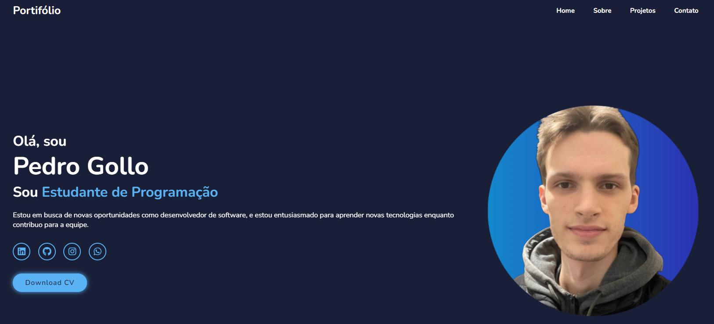

# Meu Portfólio Pessoal

> Este projeto é meu portfólio pessoal, desenvolvido utilizando HTML, CSS e JavaScript. Ele foi criado para apresentar minhas habilidades, experiências e projetos relevantes de forma clara e atrativa.

## 🔧 Tecnologias Utilizadas

No desenvolvimento deste portfólio, foram utilizadas as seguintes tecnologias:

## 💻 Acessando o Portifólio

Você pode acessar meu portfólio diretamente pelo link: `https://pbgollo.github.io/portifolio`.

## 🤝 Colaboradores

Agradecemos às seguintes pessoas que contribuíram para este projeto:

<table>
  <tr>
    <td align="center">
      <a href="https://github.com/pbgollo" title="Perfil do Pedro Gollo no GitHub">
         
        
          <b>Pedro Gollo</b>
        
      </a>
    </td>
  </tr>
</table>
